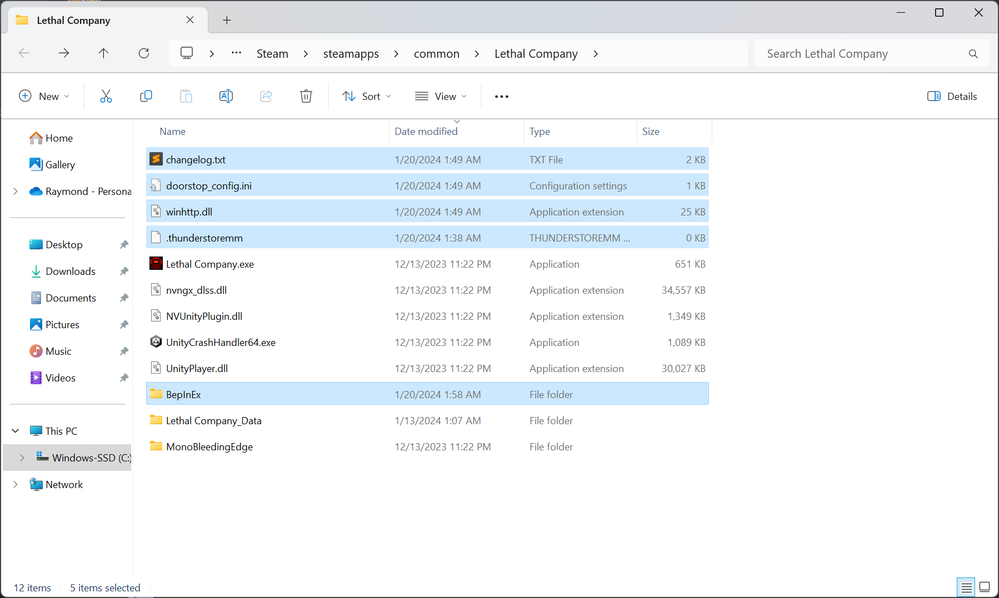

To download this repo via web interface, click on Code (green button) > Download ZIP.

To use this set of mods, drag the contents of either `HD` or `LowRes` into your game folder. To find your game folder, in your Steam Library, right click on the game > Manage > Browse local files.

The only difference between `HD` and `LowRes` is the BepInEx > config > HDLethalCompany.cfg file. Modify it yourself if needed. https://thunderstore.io/c/lethal-company/p/Sligili/HDLethalCompany/

